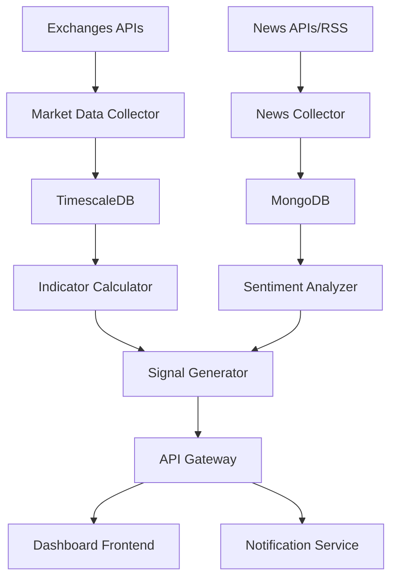

# 🚀 AI Trading Platform - Plataforma de Trading com IA Local

[](https://opensource.org/licenses/MIT)
[](https://www.docker.com/)
[](https://huggingface.co/)
[](https://www.binance.com/)

## 🎯 Visão Geral

Plataforma de inteligência de mercado para monitoramento e análise de criptoativos, operando de forma **autônoma e soberana**, sem dependência de serviços externos de IA. 

### ✨ Principais Funcionalidades

- 📊 **Coleta em Tempo Real**: Dados OHLCV de múltiplas exchanges
- 📰 **Análise de Sentimento**: Processamento local de notícias com IA
- 📈 **Indicadores Técnicos**: SMA, EMA, RSI, MACD, Bollinger Bands
- 🎯 **Sinais Inteligentes**: Recomendações automatizadas de compra/venda
- 📱 **Dashboard Interativo**: Visualização em tempo real
- 🔔 **Sistema de Alertas**: Notificações personalizáveis

### 🏗️ Arquitetura Atual vs. Planejada

**Status Atual**: Proof of Concept com N8N + PostgreSQL + Fetcher básico
**Objetivo**: Sistema completo de microserviços com IA local

## 🛠️ Requisitos Técnicos

### 📥 1. Coleta de Dados (Data Ingestion)
- **APIs de Mercado**: Binance, Coinbase, Kraken para dados OHLCV em tempo real
- **Fontes de Notícias**: NewsAPI, GNews, RSS feeds (CoinDesk, Cointelegraph)
- **Tolerância a Falhas**: Retry automático, circuit breakers, logs detalhados
- **Rate Limiting**: Respeito aos limites das APIs externas

### 🗄️ 2. Armazenamento Otimizado
- **Séries Temporais**: TimescaleDB para dados OHLCV (performance superior)
- **Dados Estruturados**: PostgreSQL para metadados, configurações, usuários
- **Cache**: Redis para dados em tempo real e pub/sub
- **Documentos**: MongoDB para notícias e dados não-estruturados

### 🧠 3. Processamento e Análise
- **Indicadores Técnicos**: TA-Lib (SMA, EMA, RSI, MACD, Bollinger Bands)
- **Análise de Sentimento**: Modelos locais (BERTimbau, FinBERT)
- **Modelos Preditivos**: LSTM, Prophet, Transformers (preparado para futuro)
- **Processamento Paralelo**: Multiprocessing para cálculos intensivos

### 📊 4. Visualização e Interface
- **Frontend Moderno**: React/Next.js com componentes responsivos
- **Gráficos Financeiros**: TradingView widgets, Chart.js
- **Tempo Real**: WebSockets para atualizações instantâneas
- **UX/UI**: Design intuitivo com dark/light mode

## 🏗️ Arquitetura de Microserviços

### 📋 Visão Geral dos Serviços

| 🔧 Serviço | 📝 Responsabilidade | 🛠️ Stack | 🔗 Comunicação |
|------------|---------------------|-----------|-----------------|
| **market-data-collector** | Ingestão dados crypto (WebSocket) | Node.js/Python | Redis Pub/Sub |
| **news-collector** | Coleta notícias e RSS feeds | Node.js | Event Queue |
| **indicator-calculator** | Cálculos técnicos (TA-Lib) | Python | gRPC |
| **sentiment-analyzer-api** | IA local para sentimento | Python/PyTorch | REST API |
| **signal-generator** | Geração de sinais compra/venda | Python | Event-Driven |
| **api-gateway** | Gateway central e auth | Node.js/Go | REST/GraphQL |
| **notification-service** | Alertas e notificações | Node.js | WebSocket |
| **dashboard-frontend** | Interface web interativa | React/Next.js | WebSocket/REST |

### 🌐 Fluxo de Dados



## 📦 Entregáveis e Roadmap

### 🎯 Entregáveis Principais
- ✅ **Diagrama de Arquitetura**: Componentes e interações (Mermaid)
- ✅ **Docker Compose**: Orquestração completa de serviços
- ✅ **Esquema de Banco**: Estruturas otimizadas para séries temporais
- ✅ **Stack Técnica**: Justificativas de escolhas arquiteturais
- ✅ **Plano de Implementação**: Roadmap em 4 fases incrementais

### 🚀 Roadmap de Implementação

#### 🏗️ **Fase 1: Fundação** (2-3 semanas)
- [ ] Migrar PostgreSQL → TimescaleDB
- [ ] Implementar Redis para cache/pub-sub
- [ ] Criar API Gateway centralizada
- [ ] Desenvolver Market Data Collector (Binance WebSocket)
- [ ] Setup de monitoramento básico

#### 🧠 **Fase 2: Análise** (3-4 semanas)
- [ ] Serviço de Indicadores Técnicos (Python + TA-Lib)
- [ ] News Collector (RSS + APIs)
- [ ] Sentiment Analyzer com modelo local (BERT)
- [ ] Sistema básico de alertas
- [ ] Testes unitários e integração

#### 📊 **Fase 3: Interface** (2-3 semanas)
- [ ] Dashboard React com gráficos TradingView
- [ ] WebSocket para dados em tempo real
- [ ] Sistema de notificações push
- [ ] Configurações de usuário e preferências
- [ ] Autenticação JWT

#### 🎯 **Fase 4: IA Avançada** (4-6 semanas)
- [ ] Modelos preditivos (LSTM/Prophet)
- [ ] Sistema de sinais automatizados
- [ ] Backtesting de estratégias
- [ ] Otimização de hiperparâmetros
- [ ] Deploy em produção

## 🎯 Ênfase Estratégica

### 💡 Objetivo Principal
Fornecer **respostas confiáveis e rápidas** sobre o momento ideal para comprar ou vender criptoativos, baseado em:

- 📈 **Evidência Técnica**: Indicadores matemáticos + padrões de mercado
- 🗞️ **Sentimento de Mercado**: Análise de notícias e mídia social
- 🤖 **Modelos Preditivos**: Tendências identificadas por IA local
- ⚡ **Execução em Tempo Real**: Latência mínima para oportunidades

### 🔒 Princípios Fundamentais

- **🏠 Soberania de Dados**: Processamento 100% local, sem dependências externas de IA
- **⚡ Performance**: Respostas em milissegundos para dados críticos
- **📏 Escalabilidade**: Arquitetura preparada para crescimento horizontal
- **🛡️ Segurança**: Proteção de dados e estratégias de trading
- **🎛️ Personalização**: IA adaptável às preferências do usuário

## 🚀 Como Começar

### Pré-requisitos
- Docker & Docker Compose
- Node.js 18+ (para desenvolvimento)
- Python 3.9+ (para IA/ML)
- 8GB+ RAM recomendado

### Instalação Rápida

```bash
# Clone o repositório
git clone <repo-url>
cd aitrading-platform

# Inicie os serviços
docker-compose up -d

# Acesse o dashboard
open http://localhost:3000
```

### Configuração de Desenvolvimento

```bash
# Instale dependências
npm install

# Configure variáveis de ambiente
cp .env.example .env

# Execute em modo desenvolvimento
npm run dev
```

## 🤝 Contribuição

1. Fork o projeto
2. Crie uma branch para sua feature (`git checkout -b feature/AmazingFeature`)
3. Commit suas mudanças (`git commit -m 'Add some AmazingFeature'`)
4. Push para a branch (`git push origin feature/AmazingFeature`)
5. Abra um Pull Request

## 📄 Licença

Distribuído sob a licença MIT. Veja `LICENSE` para mais informações.

## 📞 Contato

**AI Trading Platform**
- 📧 Email: contato@aitrading.dev
- 🐙 GitHub: [@aitrading-platform](https://github.com/aitrading-platform)
- 📚 Documentação: [docs.aitrading.dev](https://docs.aitrading.dev)

---

⭐ **Se este projeto foi útil, deixe uma estrela!** ⭐
